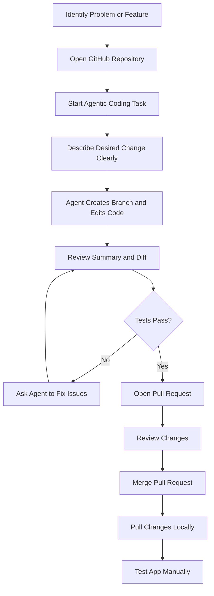
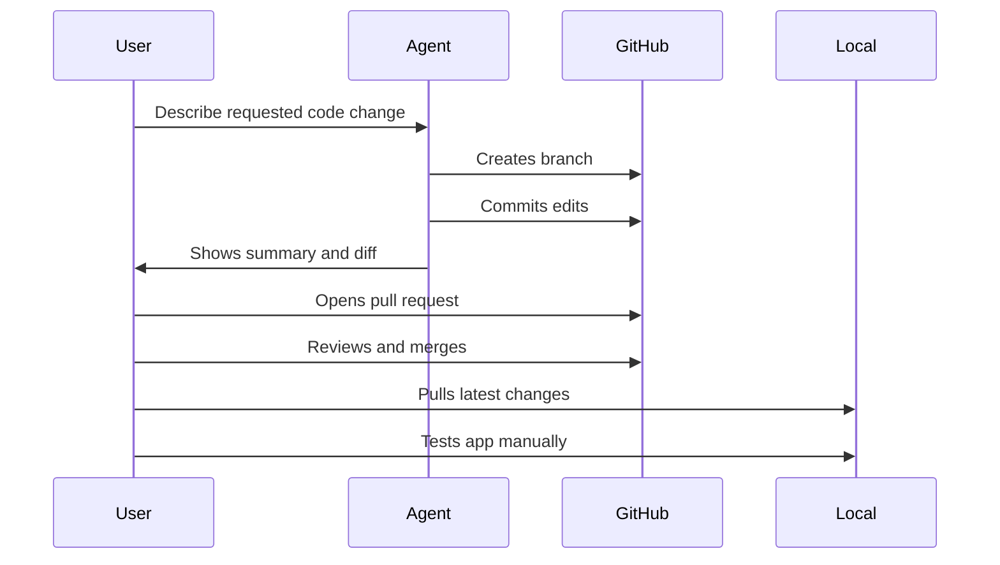
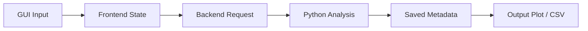

Welcome to the Printz Lab! This organization is a collection of projects that we are currently working on, and serves as a centalized hub to facilitate collaboration and data security.

Lab Wiki: https://detailed-sled-282.notion.site/07df09f917604285bca859899cecbfb4?v=61f67c8b11a6409da1e782f9d946594b

# Agentic Codebase Editing SOP
## Using AI Coding Agents to Safely Modify Lab Software

Author: Sean Raglow  
Lab: Printz Lab  
Applies to: Photo-CELIV app, EQE app, spin coater software, and related lab codebases

---

# Overview

This SOP describes how to use agentic AI coding tools, such as Codex or ChatGPT coding agents, to make controlled edits to lab software repositories.

These tools are useful when:

- You know what behavior you want changed
- You do not know exactly where in the codebase the change needs to happen
- The project has multiple connected parts, such as:
  - JavaScript frontend
  - FastAPI backend
  - Python analysis scripts
  - Hardware-control logic

The main idea is:

```text
Describe the desired change clearly → let the agent modify the code → review the diff → test → merge
```

---

# Example Use Case

A Photo-CELIV app was missing a setting for device thickness.

Because device thickness affects mobility analysis, the software needed a new user-editable parameter.

The agentic workflow was used to:

1. Locate the relevant frontend and backend code
2. Add a device thickness setting
3. Pass that value into the analysis logic
4. Generate a pull request
5. Review and merge the change

---

# Recommended Workflow



---

# When to Use an Agent

Use an AI coding agent for:

- Adding GUI parameters
- Updating analysis settings
- Refactoring repeated code
- Fixing small bugs
- Adding documentation
- Improving README files
- Writing tests
- Updating plotting or file-saving behavior

Avoid using an AI coding agent blindly for:

- Safety-critical hardware behavior
- Sensitive/private/proprietary code
- Anything that could damage equipment if wrong

---

# Before Starting

## Make Sure the Repository Is Clean

Before using an agent, confirm that your local code is synced and committed.

If using GitHub Desktop:

1. Open the repository
2. Pull latest changes
3. Confirm there are no uncommitted changes

If using command line:

```bash
git status
git pull
```

---

# Writing a Good Agent Prompt

A good prompt should include:

- What app you are editing
- What feature or bug you noticed
- What behavior you want
- Where the parameter should appear
- How it should affect saved data or analysis
- Any constraints

---

# Example Prompt

```text
In the Photo-CELIV app, add a user-editable device thickness parameter to the GUI.

The value should be used in the mobility analysis instead of being hard-coded.

Use nanometers as the displayed unit in the GUI, but make sure the backend converts units correctly if needed.

Save the thickness value with the measurement metadata so future analysis knows what thickness was used.

Update any relevant tests or add a basic test if appropriate.
```

---

# Let the Agent Work

After submitting the task:

1. Let the agent inspect the codebase
2. Let it make edits
3. Wait for the summary
4. Do not merge immediately

The agent may modify:

- Frontend files
- Backend request models
- Analysis scripts
- Tests
- Documentation

---

# Reviewing the Agent's Work

When the agent finishes, review:

- Summary of changes
- Files changed
- Number of lines changed
- Test results
- Any warnings or failed tests

---

# Pull Request Workflow



---

# Reviewing File Changes

In the pull request, inspect each changed file.

Look for:

- Hard-coded values
- Incorrect units
- Broken variable names
- Missing defaults
- Changes to unrelated files
- Hardware behavior changes
- Analysis equations changed unexpectedly

In many simple cases, you may accept the current change, but you should still read the diff.

---

# Testing

## Automated Tests

If the repository has tests, check that they passed.

Example:

```bash
pytest
```

If there are no tests, consider asking the agent to add basic tests.

---

## Manual Testing

After merging and pulling locally:

1. Start the app
2. Refresh the browser
3. Confirm the new setting appears
4. Change the setting
5. Run a simulated or real measurement
6. Confirm the setting affects the output correctly
7. Confirm data still saves in the expected folder

---

# Pulling the Changes Locally

Using GitHub Desktop:

1. Open the repository
2. Click `Fetch origin`
3. Click `Pull origin`
4. Restart the app

Using command line:

```bash
git checkout main
git pull
```

---

# Restarting the App

For FastAPI apps, restart the server after pulling changes.

Example:

```bash
uvicorn photo_celiv_app.main:app --reload
```

or use the desktop shortcut if one exists.

Then refresh the browser.

---

# Common Agentic Editing Pattern



When adding a new parameter, make sure it flows through every required layer.

---

# Checklist for Adding a New Measurement Parameter

Use this checklist for parameters such as:

- Device thickness
- Ramp rate
- Offset voltage
- Vmax
- Scan step size
- Averaging count
- Sample area

## Required Checks

- [ ] Parameter appears in GUI
- [ ] Parameter has a sensible default
- [ ] Units are displayed clearly
- [ ] Backend receives the value
- [ ] Analysis uses the value
- [ ] Value is saved with measurement metadata
- [ ] Existing measurements still work
- [ ] Tests pass or manual testing succeeds

---

# Security and Privacy Notes

Do not upload or expose sensitive code unless allowed.

Be especially careful with:

- Private repositories
- Proprietary hardware-control code
- API keys
- Passwords
- Instrument IP addresses
- University credentials
- Unpublished research data

Before using any AI coding agent, check whether the code is appropriate to share with that service.

---

# Best Practices

## Give the Agent a Small Task

Good:

```text
Add a device thickness setting to the Photo-CELIV GUI and use it in mobility analysis.
```

Too broad:

```text
Fix the Photo-CELIV app.
```

---

## Review Before Merging

Never merge agent-generated code without reading the diff.

---

## Prefer Pull Requests

Pull requests make it easier to:

- Review changes
- Track what was modified
- Revert mistakes
- Document why changes were made

---

## Keep Changes Small

Small changes are easier to review and safer to merge.

---

# Troubleshooting

## Agent Changed Too Much

Ask it to simplify the pull request or revert unrelated changes.

```text
Please reduce this PR to only the changes needed for the device thickness parameter. Revert unrelated formatting or refactoring.
```

---

## Tests Failed

Ask the agent to inspect and fix the failing tests.

```text
The tests failed. Please identify the failure and update the code or tests appropriately without changing unrelated behavior.
```

---

## App Does Not Update Locally

Check:

- Did you merge the PR?
- Did you pull latest changes?
- Did you restart the backend?
- Did you refresh the browser?
- Are you on the correct branch?

---

## New GUI Setting Appears but Does Nothing

Likely cause:

```text
Frontend was updated, but backend or analysis code was not.
```

Ask the agent to trace the parameter through the full stack.

---

# Example: Device Thickness Parameter

For Photo-CELIV, device thickness affects mobility analysis.

Correct implementation should include:

- GUI field for device thickness
- Clear unit, likely nm
- Backend request field
- Conversion to meters or centimeters as required
- Use in mobility calculation
- Saved metadata
- Updated analysis output

---

# Recommended Agent Prompt Template

```text
I am editing the [APP NAME] repository.

Problem:
[Describe the bug or missing feature.]

Desired behavior:
[Describe what the software should do.]

Implementation constraints:
- Keep the change minimal.
- Do not refactor unrelated code.
- Preserve existing behavior unless needed.
- Update tests if tests exist.
- Save any new measurement parameter in metadata if relevant.

Please make the code changes in a new branch and summarize exactly what files were changed.
```

---

# Final Verification Checklist

Before considering the change complete:

- [ ] Pull request reviewed
- [ ] Tests checked
- [ ] App launches
- [ ] GUI behaves correctly
- [ ] Measurement or simulation runs
- [ ] Output files save correctly
- [ ] Analysis result is reasonable
- [ ] Change is documented

---

# End of SOP
